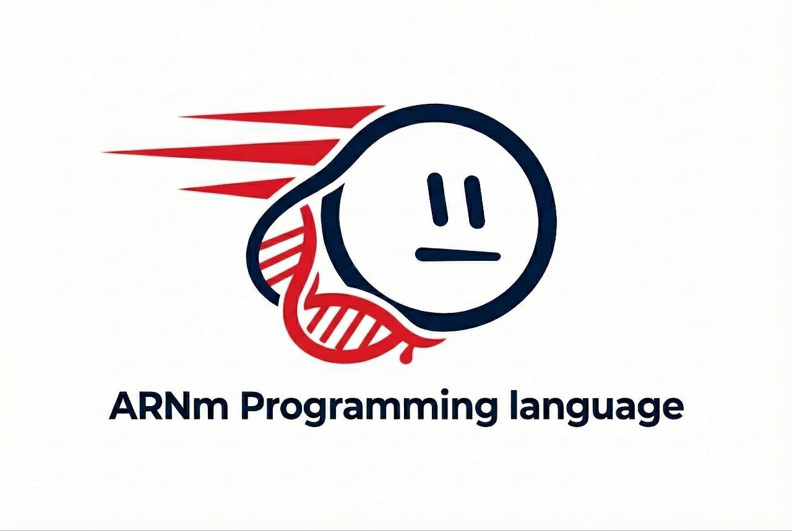
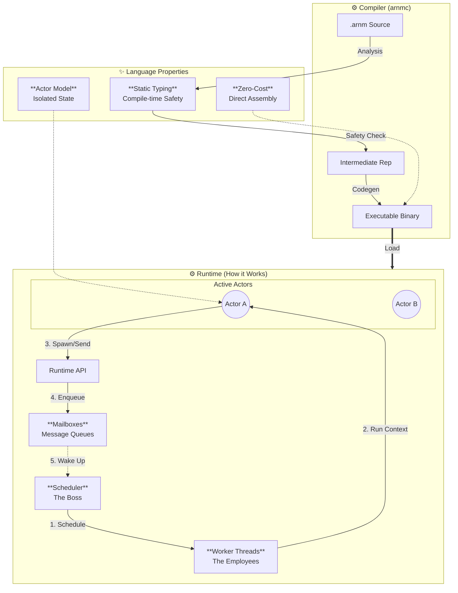
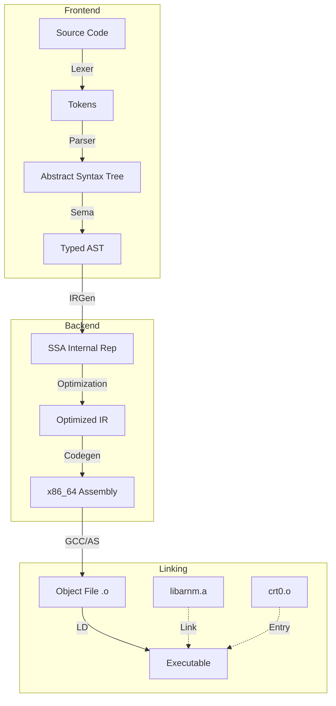

# ARNm Programming Language

> **A high-performance, actor-based programming language built for massive concurrency.**


 <p align="center">
  
</p>

## 🚀 Overview

**ARNm** (pronounced "Arnum") is a modern, statically-typed compiled language designed from the ground up for scalable concurrency. Inspired by Erlang's actor model and C's raw performance, ARNm empowers developers to build fault-tolerant, distributed systems with ease.

### Key Features

- **🎭 Native Actor Model**: Lightweight processes with isolated memory and message-passing concurrency.
- **⚡ Zero-Cost Abstractions**: Compiled directly to optimized x86_64 assembly.
- **🛡️ Safety & Speed**: Strong static typing with a focus on runtime performance.
- **🧵 Massive Scalability**: Efficient user-space scheduling capable of handling millions of concurrent actors.
- **🧩 Modern Syntax**: Clean, expressive syntax inspired by Rust and Swift.

### Architecture

### 🌌 Language Ecosystem & Execution Flow

This diagram illustrates how ARNm's properties interact and "who does the work" during execution:



## 🛠️ Getting Started

### Prerequisites

- Linux (x86_64)
- GCC / Make
- Git

### Installation

Clone the repository and build the compiler and runtime:

```bash
git clone https://github.com/mouuuuaad/ARNm-Programming-Language.git
cd arnm-lang
make
make -C runtime
```

This will produce the `arnmc` compiler binary in the `build/` directory.

## 💻 Usage

### Writing Your First Actor

Create a file named `hello.arnm`:

```rust
actor Greeter {
    fn init() {
        print(42); // Hello World integer equivalent
    }
}

fn main() {
    spawn Greeter();
}
```

### Compiling and Running

Use the `arnmc` compiler to generate an executable:

```bash
# Compile to assembly and link with runtime
./build/arnmc --emit-asm hello.arnm > hello.s
gcc -c hello.s -o hello.o
gcc -o hello runtime/build/crt0.o hello.o -Lruntime/build -larnm -lpthread

# Run it
./hello
```

*(Note: We are working on a unified `build` command to automate the linking process.)*

## � Developer Guide

This section details the internal workflows for developing and using ARNm.

### 🧠 Compilation Pipeline

The ARNm compiler (`arnmc`) transforms source code into machine code through several phases:



### 🏗️ Build System Architecture

The project uses a split Make system to ensure modularity:

1.  **Root Makefile**:
    *   Builds the **Compiler** (`arnmc`).
    *   Manages overarching test commands.
    *   *Artifact*: `build/arnmc` (The executable compiler).

2.  **Runtime Makefile** (`runtime/Makefile`):
    *   Builds the **Runtime Library** (`libarnm.a`).
    *   Compiles the **C Runtime Entry** (`crt0.o`).
    *   *Artifacts*:
        *   `runtime/build/libarnm.a`: Static archive of scheduler, memory, and mailbox logic.
        *   `runtime/build/crt0.o`: Assembly entry point (`_start`) that initializes the runtime before calling `main`.

**Detailed Build Steps:**

```bash
# 1. Full Clean (Recommended for fresh builds)
make clean && make -C runtime clean

# 2. Compile Compiler Sources
# Compiles src/*.c -> build/*.o -> build/arnmc
make

# 3. Compile Runtime Components
# Compiles runtime/src/*.c -> runtime/build/*.o -> runtime/build/libarnm.a
make -C runtime
```

### 📦 Manual Compilation Workflow

Since ARNm produces assembly, creating an executable requires a specific linking sequence. Here is the complex flow for compiling `hello.arnm`:

1.  **Transpile to Assembly**:
    The compiler outputs raw x86_64 assembly code.
    ```bash
    ./build/arnmc --emit-asm hello.arnm > hello.s
    ```

2.  **Assemble**:
    Convert the assembly text into a relocatable object file.
    ```bash
    gcc -c hello.s -o hello.o
    ```

3.  **Link (The Critical Step)**:
    We must combine:
    *   `crt0.o`: The entry point that sets up the stack and calls `_arnm_main`.
    *   `hello.o`: Your compiled actor code.
    *   `libarnm`: The runtime library (scheduler, memory manager).
    *   `pthread`: Required for the scheduler's threading model.

    ```bash
    gcc -o hello runtime/build/crt0.o hello.o -Lruntime/build -larnm -lpthread
    ```

### 🧪 Testing Strategy

Our testing is layered to isolate failures:

| Layer | Command | Target | Description |
| :--- | :--- | :--- | :--- |
| **Unit** | `make test_lexer` | `compiler/tests/` | Verifies individual tokens and small parsing rules. |
| **Integration** | `make test_irgen` | `compiler/tests/` | Checks if AST translates to valid IR without crashing. |
| **End-to-End** | `examples/test_*.arnm` | `examples/` | Full compilation & execution. Verified by regex on output. |

To run the full regression suite:
```bash
make test
```

## 🚧 Feature Status

| Feature | Status | Description |
| :--- | :---: | :--- |
| **Actor Primitives** | ✅ | Native `spawn`, `send`, `receive` support. |
| **Control Flow** | ✅ | `if`, `while`, `loop` with `break`/`continue`. |
| **Type System** | 🚧 | Strong static typing. Structs partial. |
| **Memory Safety** | 🚧 | Basic bounds checking planned. |
| **Modules** | ❌ | Import system coming in v0.3. |
| **Performance** | 🚀 | Zero-cost abstractions & asm backend. |

## 🤝 Contributing

Contributions are welcome! Please feel free to submit a Pull Request.
