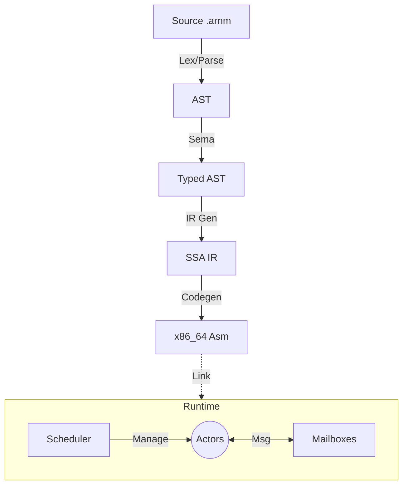

# ARNm Programming Language

> **A high-performance, actor-based programming language built for massive concurrency.**


## 🚀 Overview

**ARNm** (pronounced "Arnum") is a modern, statically-typed compiled language designed from the ground up for scalable concurrency. Inspired by Erlang's actor model and C's raw performance, ARNm empowers developers to build fault-tolerant, distributed systems with ease.

### Key Features

- **🎭 Native Actor Model**: Lightweight processes with isolated memory and message-passing concurrency.
- **⚡ Zero-Cost Abstractions**: Compiled directly to optimized x86_64 assembly.
- **🛡️ Safety & Speed**: Strong static typing with a focus on runtime performance.
- **🧵 Massive Scalability**: Efficient user-space scheduling capable of handling millions of concurrent actors.
- **🧩 Modern Syntax**: Clean, expressive syntax inspired by Rust and Swift.

### Architecture



## 🛠️ Getting Started

### Prerequisites

- Linux (x86_64)
- GCC / Make
- Git

### Installation

Clone the repository and build the compiler and runtime:

```bash
git clone https://github.com/mouuuuaad/ARNm-Programming-Language.git
cd arnm-lang
make
make -C runtime
```

This will produce the `arnmc` compiler binary in the `build/` directory.

## 💻 Usage

### Writing Your First Actor

Create a file named `hello.arnm`:

```rust
actor Greeter {
    fn init() {
        print(42); // Hello World integer equivalent
    }
}

fn main() {
    spawn Greeter();
}
```

### Compiling and Running

Use the `arnmc` compiler to generate an executable:

```bash
# Compile to assembly and link with runtime
./build/arnmc --emit-asm hello.arnm > hello.s
gcc -c hello.s -o hello.o
gcc -o hello runtime/build/crt0.o hello.o -Lruntime/build -larnm -lpthread

# Run it
./hello
```

*(Note: We are working on a unified `build` command to automate the linking process.)*

## 🔄 Workflows

### 🏗️ Build Project

To build the entire project from source (Compiler & Runtime):

```bash
# 1. Clean previous builds (Optional)
make clean && make -C runtime clean

# 2. Build Compiler (outputs build/arnmc)
make

# 3. Build Runtime (outputs runtime/build/libarnm.a)
make -C runtime
```

### 🧪 Run Tests

The project includes a comprehensive test suite for each compiler phase:

```bash
# Run ALL tests
make test

# Run specific suites
make test_lexer   # Lexer
make test_parser  # Parser
make test_sema    # Semantic Analysis
make test_irgen   # IR Generation
make test_codegen # Code Generation
```

### 📦 Manual Compilation

Until the unified build command is ready, use this flow to compile an `.arnm` file:

```bash
# 1. Compile to Assembly
./build/arnmc --emit-asm examples/test_loops.arnm > build/output.s

# 2. Assemble to Object File
gcc -c build/output.s -o build/output.o

# 3. Link with Runtime
gcc -o program runtime/build/crt0.o build/output.o -Lruntime/build -larnm -lpthread

# 4. Run
./program
```

## 🚧 Feature Status

| Feature | Status | Description |
| :--- | :---: | :--- |
| **Actor Primitives** | ✅ | Native `spawn`, `send`, `receive` support. |
| **Control Flow** | ✅ | `if`, `while`, `loop` with `break`/`continue`. |
| **Type System** | 🚧 | Strong static typing. Structs partial. |
| **Memory Safety** | 🚧 | Basic bounds checking planned. |
| **Modules** | ❌ | Import system coming in v0.3. |
| **Performance** | 🚀 | Zero-cost abstractions & asm backend. |

## 🤝 Contributing

Contributions are welcome! Please feel free to submit a Pull Request.
